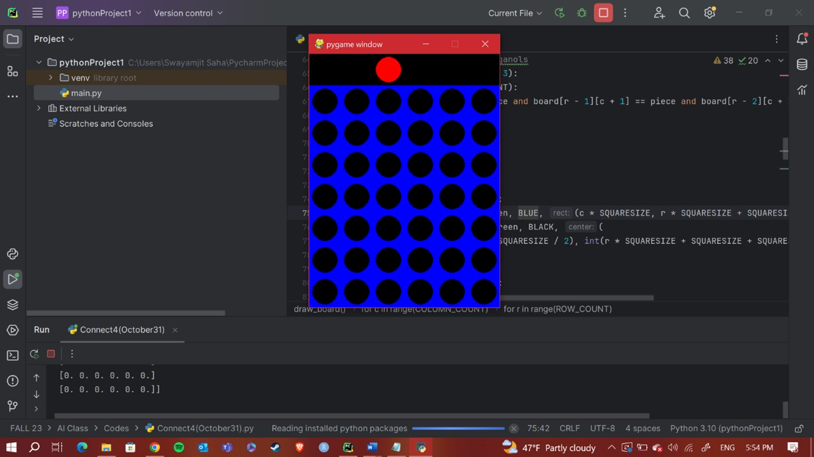
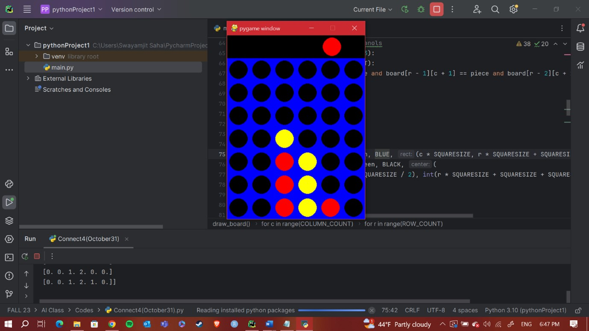
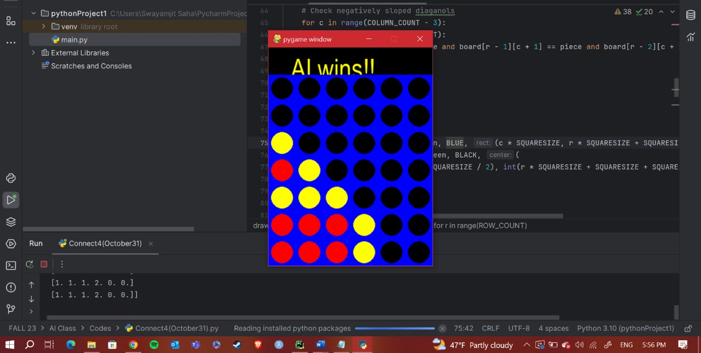

# Connect4AI
Development of the popular Connect-4 game using Python library Pygame

Methodology:
Firstly, we break down the minimax algorithm with alpha-beta pruning in simple steps:
Step 1: Defining the Minimax Function
Define a function called minimax that takes four parameters - the current state of the game (node), the depth in the game tree, a Boolean variable indicating if it's the maximizing player's turn, and the current best values for the maximizing and minimizing players (alpha and beta).

Step 2: Checking Base Case
If the depth is zero or the current state is a terminal node viz. end of the game, return the heuristic value of that node, which represents how good or bad the current state is.

Step 3: Maximizing Player's Turn
If it's the maximizing player's turn:
  - Initialize maxEval to negative infinity.
  - For each possible move (child) from the current state:
    - Recursively call the minimax function for the child with decreased depth.
    - Update maxEval to the maximum of its current value and the evaluation from the recursive call.
    - Update alpha to the maximum of its current value and maxEval.
    - If beta is less than or equal to alpha, stop exploring further (alpha-beta pruning).
  - Return maxEval.

Step 4: Minimizing Player's Turn
If it's the minimizing player's turn:
  - Initialize minEval to positive infinity.
  - For each possible move (child) from the current state:
    - Recursively call the minimax function for the child with decreased depth.
    - Update minEval to the minimum of its current value and the evaluation from the recursive call.
    - Update beta to the minimum of its current value and minEval.
    - If beta is less than or equal to alpha, stop exploring further (alpha-beta pruning).
  - Return minEval.

Step 5: Initial Call
Make the initial call to the minimax function with the root state, the desired depth, and initial values for maximizing player (True), alpha (negative infinity), and beta (positive infinity).

The algorithm evaluates different moves in a game tree, considering both players' perspectives. Alpha-beta pruning helps the algorithm avoid unnecessary calculations by discarding branches that won't affect the final decision, making the search more efficient.

Depth parameter
The `depth` parameter here acts a pivotal part in the difficulty of the AI algorithm. We can increase or decrease the difficulty level of the game against the AI algorithm by incrementing or decrementing the value of the `depth` parameter inside the code chunk. For instance, `depth` value at 4 will include more chances of the human player winning the game as compared to the same `depth` variable set at value 10. Also, one interesting thing to note is more the value of the depth value more will be the computational processing time. For instance,  

Drawing the board
PyGame library was installed and incorporated to visualize the game graphics. For drawing the board, the `SQUARESIZE` variable was set to the value 50. The idea was to draw black circles over blue rectangles as seen in Fig. 5. There was also a black rectangular space where the red or yellow pieces were hovered upon and at the end of each round the player winning details were showed.

Instance #1
The below snippet shows the starting of the Connect Four game with the Player 1 hovering over the board with the red disc (piece). 

  
 

 
Instance #2
The below snippet shows the Connect Four game where the Player 1 denoted by red discs is competing against the AI algorithm denoted by yellow discs. 

  
 

 
Instance #3
The below snippet shows a scenario where the AI algorithm has won with the winning move by matching the yellow pieces in a diagonal fashion.

  
 

 
Time Complexity and Actual Runtime
The optimal time complexity of the Minimax algorithm with alpha-beta pruning heuristic that was used in the experiment is O(bD ), where b denotes the branching factor and d denotes the depth of the game tree. The actual compile runtime of the programming was ~1 seconds with depth value set at 4.

Conclusion:
The implementation of Connect Four game in graphics was particularly interesting and challenging. I imported PyGame library to build the game using graphics in contrast to the matrix calculations that were happening in the background. I also used alpha beta pruning heuristic as an optimization technique for the minimax algorithm for AI to function in the game. Previous works on minimax algorithm for tic-tac-toe did inspire to create the game using almost similar logic. I also tried to set the difficulty of the game to varied levels so that the computation times for the varied settings can be noted. It was evident that with the increase in value of the `depth` parameter the computation speed reduced considerably. Furthermore, I believe other traditional and more advanced AI algorithms or deep learning techniques could be incorporated to the same Connect Four game to see how the game performance changes and whether they would be smart enough to intellectually challenge the human players.

References
[1] Edelkamp, S. (2002, April). Symbolic exploration in two-player games: Preliminary results. In The International Conference on AI Planning & Scheduling (AIPS), Workshop on Model Checking (pp. 40-48).
[2] Thill, M., Koch, P., & Konen, W. (2012). Reinforcement learning with n-tuples on the game Connect-4. In Parallel Problem Solving from Nature-PPSN XII: 12th International Conference, Taormina, Italy, September 1-5, 2012, Proceedings, Part I 12 (pp. 184-194). Springer Berlin Heidelberg.
[3] Allis, V. (1988). A knowledge-based approach of Connect-4. The game is solved: White wins. master's thesis, Dept. Math. Comput. Sci., Vrije Universiteit, Amsterdam, The Netherlands.
[4] Thill, M. (2012). Using n-tuple systems with TD learning for strategic board games. CIOP Report, 1, 12.
[5] Kopec, D. (2019). Classic computer science problems in Python. Simon and Schuster.
[6] PyGame (2023, October 31). PyGame Documentation. https://www.pygame.org/docs/
[7] NumPy (2023, October 31). NumPy Documentation. https://numpy.org/doc/stable/
[8] Bradley, M., and Hasbro (2023, October 31). Connect Four. Wikipedia. https://en.wikipedia.org/wiki/Connect_Four
